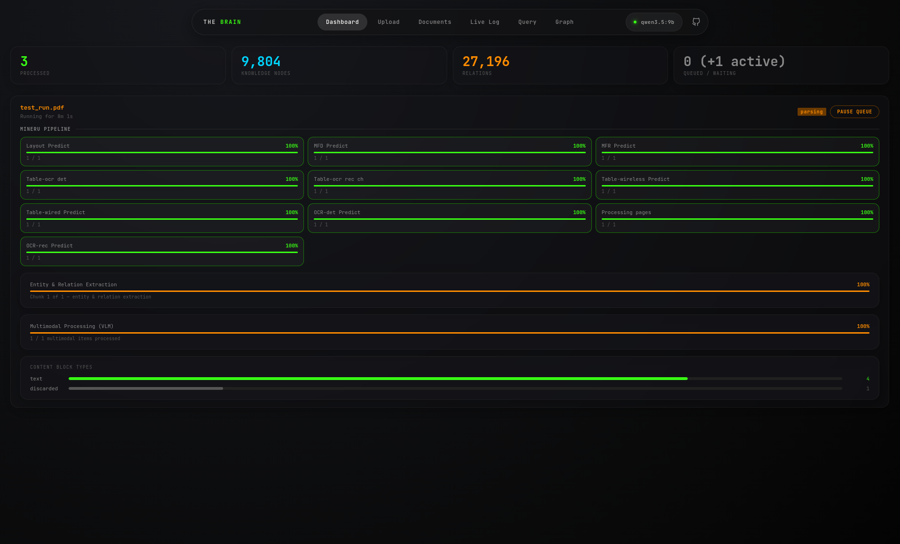
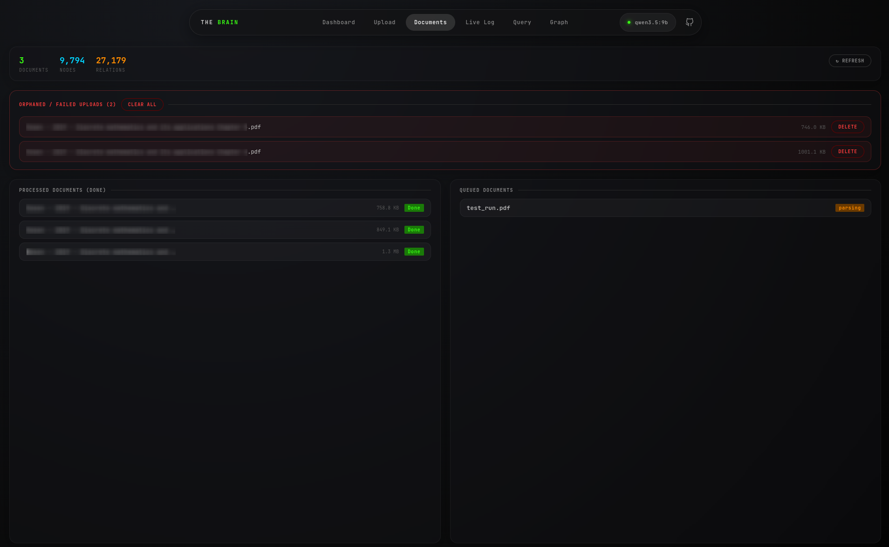
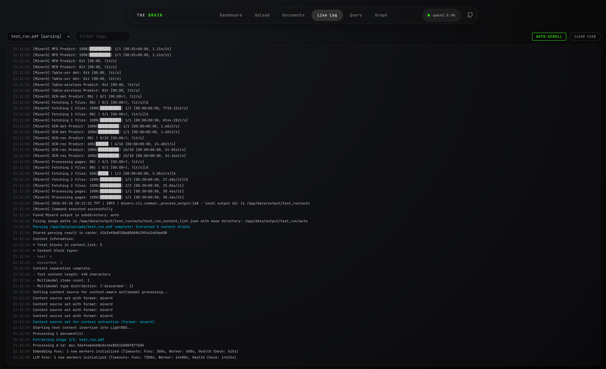
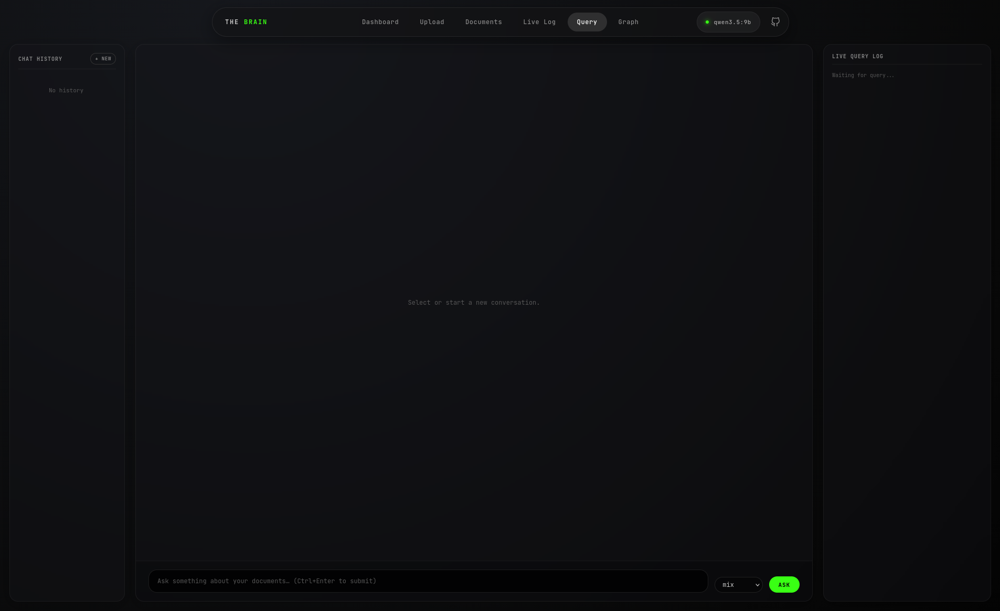
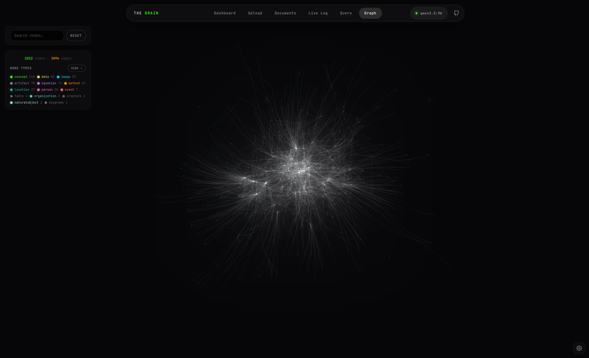
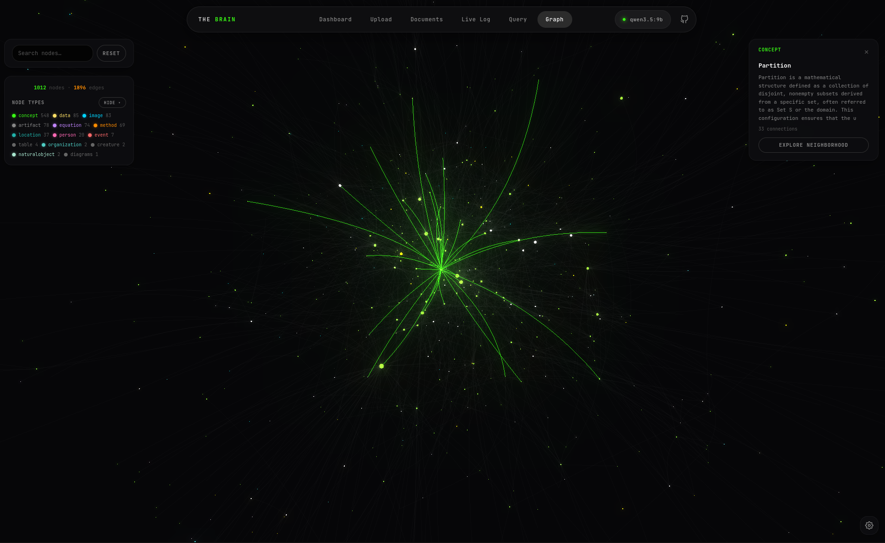
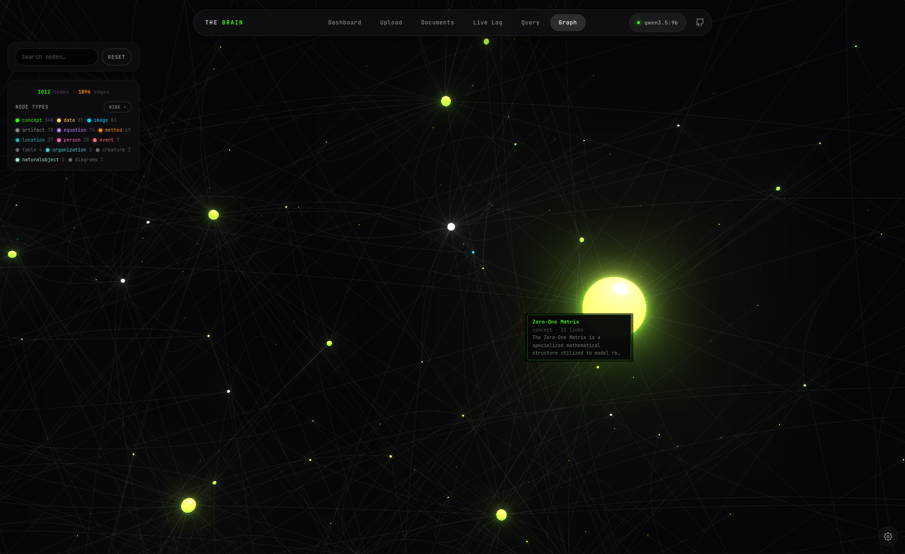

# The Brain - Multimodal RAG

The Brain is a Retrieval-Augmented Generation (RAG) dashboard and 3D Knowledge Graph visualizer. It is designed to ingest multimodal documents (text, images, tables, equations) and provide an interactive interface for querying and exploring the resulting knowledge base. 

The system is built on top of the LightRAG and RAG-Anything frameworks. It supports fully offline execution via local models or cloud-based execution via any OpenAI-compatible API.


## Architecture

* **Backend:** Python, FastAPI, Uvicorn, Server-Sent Events (SSE) for real-time log streaming.
* **RAG Pipeline:** LightRAG and RAG-Anything.
* **Document Parser:** MinerU (handles PDF layout detection, OCR, and multimodal extraction).
* **Databases:** Neo4j (Knowledge Graph) and NanoVectorDB (Vector Storage).
* **Reranker:** `BAAI/bge-reranker-v2-m3` (Downloaded and loaded into memory automatically on the first application startup).

## Quick Start

The application is distributed via the GitHub Container Registry. No local build is required.

Create a `compose.yml` file:

```yaml
services:
  the-brain:
    image: ghcr.io/hastur-hp/the-brain:latest
    container_name: the_brain
    restart: unless-stopped
    network_mode: "host"
    environment:
      # Local Connection
      - OLLAMA_BASE_URL=http://localhost:11434

      # External Connection (uncomment to use)
      #- OPENAI_API_KEY=
      #- OPENAI_BASE_URL=

      # Models
      - LLM_MODEL=qwen3.5:9b
      - EMBEDDING_MODEL=qwen3-embedding:8b
      - VISION_MODEL=qwen2.5vl:latest

      # Model Settings & Tuning
      - LLM_NUM_CTX=32768
      - LLM_TIMEOUT=7200
      - LLM_MAX_ASYNC=1

      - EMBEDDING_DIM=4096
      - MAX_EMBED_TOKENS=8192
      - EMBEDDING_TIMEOUT=300
      - EMBEDDING_MAX_ASYNC=1

      # Document Chunking
      - CHUNK_SIZE=600
      - CHUNK_OVERLAP_SIZE=100

      # Neo4j
      - NEO4J_URI=bolt://localhost:7687
      - NEO4J_USERNAME=neo4j
      - NEO4J_PASSWORD=${NEO4J_PASSWORD}
      - NEO4J_DATABASE=neo4j

      # Internal paths (mapped to volume)
      - WORKING_DIR=/app/data/rag_storage
      - UPLOAD_DIR=/app/data/uploads
      - OUTPUT_DIR=/app/data/output
      - PARSER=mineru
    volumes:
      - thebrain_data:/app/data
      - thebrain_mineru_models:/root/.cache/huggingface
    depends_on:
      neo4j:
        condition: service_healthy

  # Neo4j
  neo4j:
    image: neo4j:5
    container_name: lightrag_neo4j
    restart: unless-stopped
    environment:
      - NEO4J_AUTH=neo4j/${NEO4J_PASSWORD}
      - NEO4J_PLUGINS=["apoc"]
    ports:
      - "7474:7474"
      - "7687:7687"
    volumes:
      - neo4j_data:/data
      - neo4j_plugins:/plugins
    healthcheck:
      test:
        [
          "CMD", "cypher-shell", "-u", "neo4j", "-p", "${NEO4J_PASSWORD}", "RETURN 1",
        ]
      interval: 10s
      timeout: 5s
      retries: 10

volumes:
  neo4j_data:
    name: lightrag_neo4j_data
  neo4j_plugins:
    name: lightrag_neo4j_plugins
  thebrain_data:
    name: thebrain_data
  thebrain_mineru_models:
    name: thebrain_mineru_models
````

**Change Password!**
Remember to change the password for the neo4j container.

Run the stack:

Bash

```
docker compose up -d
```

Access the application at `http://localhost:8100`.

## Environment Variable Configuration

The application dynamically routes requests based on the provided environment variables.

### API Routing

- `OPENAI_API_KEY`: If this variable is populated, the application will automatically route all LLM, Vision, and Embedding requests to the external API.
    
- `OPENAI_BASE_URL`: Defines the external endpoint. Defaults to standard OpenAI, but can be pointed to GitHub Models (`https://models.inference.ai.azure.com`), DeepSeek, Groq, or any OpenAI-compatible proxy.
    
- `OLLAMA_BASE_URL`: If `OPENAI_API_KEY` is empty, the application falls back to this local Ollama instance.
    

### Models & Dimensions

- `LLM_MODEL`: The text model used for entity extraction and querying.
    
- `VISION_MODEL`: The multimodal model used for processing images, tables, and equations.
    
- `EMBEDDING_MODEL`: The model used for vectorizing text.
    
- `EMBEDDING_DIM`: This must match the exact output dimension of your chosen `EMBEDDING_MODEL` 
    

### Concurrency & Rate Limiting

- `LLM_MAX_ASYNC` & `EMBEDDING_MAX_ASYNC`: Controls the maximum number of concurrent API requests made during document processing.
    
    - **Local Hardware:** Tune based on VRAM capacity.
        
    - **Free Tier APIs (e.g., GitHub Models):** Keep at `1` to avoid `429 Too Many Requests` errors.
        
    - **Paid APIs (e.g., OpenAI Tier 2+):** Increase to `10` or higher to process documents significantly faster.
        

### Document Processing

- `CHUNK_SIZE`: Token length for document splitting.
    
- `CHUNK_OVERLAP_SIZE`: Number of overlapping tokens between chunks to preserve context.
    

## Web UI

### Dashboard
* View global counts of processed documents, total knowledge nodes, and relationships.
* Monitor the granular progress of the currently active document in the queue.
* Track specific pipeline stages, including OCR layout detection (MinerU), LLM entity extraction, and Multimodal/VLM processing.
* Use the "Pause Queue" button to gracefully halt processing after the active document finishes.

### Documents
* Review the size and status of successfully processed documents.
* Track the exact state of queued files waiting for extraction.
* Identify orphaned or failed uploads that crashed during processing (e.g., due to API rate limits).
* Use the "Delete" buttons to clear failed attempts from the system storage.


### Live Log
* Select a specific active or historical job from the top-left dropdown to view its processing logs.
* Type in the filter box to isolate specific events (e.g., isolating "error" or "extracting" logs).
* Use the "Auto-Scroll" toggle to follow the live feed, or "Clear View" to reset the terminal output.


### Query
* Submit test queries about your documents in the bottom input field.
* Select the retrieval mode (e.g., "mix") from the dropdown to dictate how the RAG engine traverses the vector and graph databases.
* Access past conversations using the left history sidebar.
* Monitor the right-hand "Live Query Log" sidebar to see which graph entities and chunks the LLM is retrieving to formulate its answer.


### Graph
* Click and drag to rotate
* Use the left control panel to search for specific nodes by name.
* Toggle the visibility of specific entity types (e.g., hide "concept" nodes to isolate "image".
* Click on any node to open the right-hand details panel, which displays its full text description and connection count.
* Click "Explore Neighborhood" to isolate the view to only that node and its direct 1-hop and 2-hop relationships.



## Acknowledgements

This project relies heavily on the open-source research and engineering from the **HKUDS (HKU Data Science Lab)** team.

- [RAG-Anything](https://github.com/HKUDS/RAG-Anything)
    
- [LightRAG](https://github.com/HKUDS/LightRAG)
